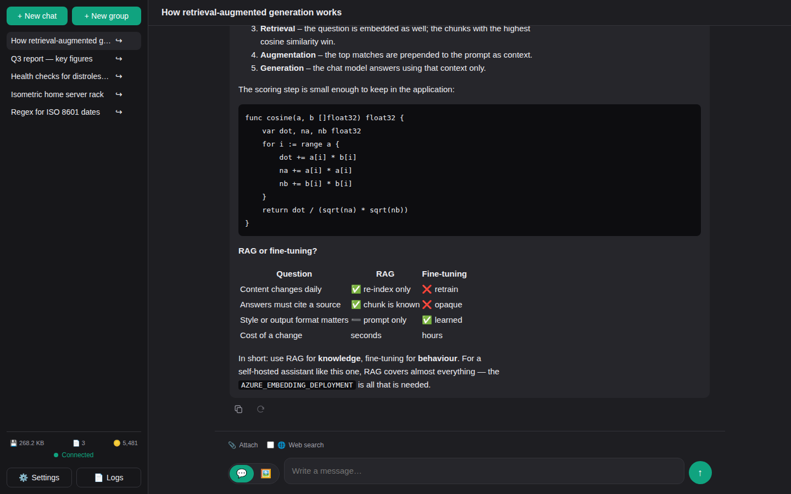
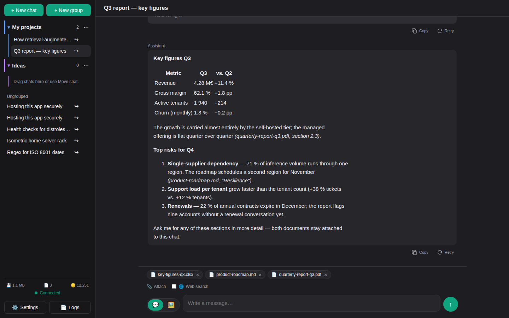
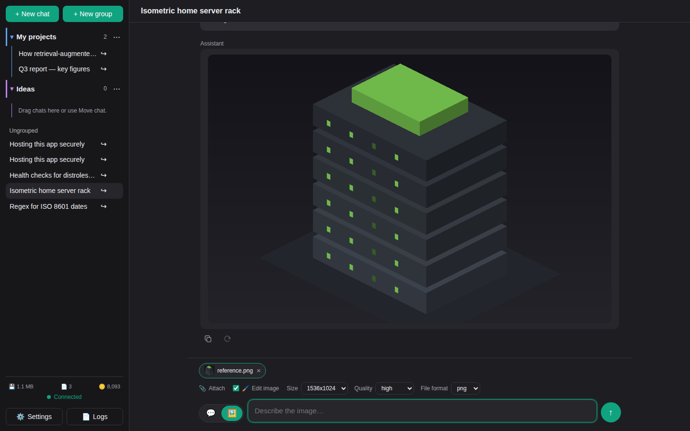
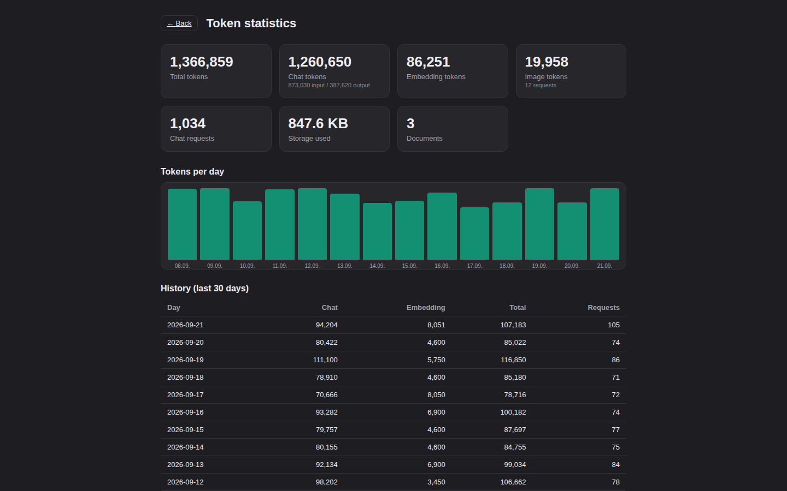

# ai-ui

[](https://github.com/daknoblo/ai-ui/actions/workflows/ci.yml)
[](https://daknoblo.github.io/ai-ui/)
[](https://github.com/daknoblo/ai-ui/releases/latest)
[](go.mod)
[](LICENSE)
[](https://github.com/daknoblo/ai-ui/pkgs/container/ai-ui)

A small, self-hosted ChatGPT-like web interface written in Go with document
context (RAG), connected to an Azure Foundry model router (Azure OpenAI
compatible).

**Website with the full screenshot gallery:**
<https://daknoblo.github.io/ai-ui/>

## Screenshots

[](https://daknoblo.github.io/ai-ui/#screenshots)

| Documents as context (RAG) | Image generation | Token statistics |
| -------------------------- | ---------------- | ---------------- |
|  |  |  |

All screenshots are generated automatically from the demo instance
([cmd/demo](cmd/demo)) - see [Demo & documentation](#demo--documentation).

## Features

- Chat interface with a sidebar, multiple conversations and history
- Answer streaming (token by token) via server-sent events
- Model picker in the top right of the chat window ("Auto" lets the router
  decide). The list comes from `AZURE_MODELS`; the selection is global and
  survives switching chats
- Document upload (text/Markdown, PDF, DOCX) as RAG context
  (embeddings + brute-force cosine search)
- Attach documents next to the input field (📎) or drag and drop them into the
  chat window; attached documents are shown as chips above the input
- Optional web search (🌐) per request: pulls in current online results as
  context - provider agnostic (Tavily, Brave Search, SearXNG)
- Optional image generation (🖼): the toggle switches the next message from a
  chat answer to a generated image (Azure image models such as `gpt-image-2`);
  images are stored in the database and shown inline. Attaching an image turns
  the next prompt into an edit of that image
- Documents are bound to their chat and are removed together with it
  (including their embeddings)
- Settings dialog in the UI (language, endpoints, deployments, API version,
  system prompt, temperature, reasoning effort); the configured models are
  listed read-only
- User interface available in **English and German**, switchable in the settings
- Readiness/connection check: uploads are only possible once storage and the
  embedding endpoint are verified; checked at start-up and periodically in the
  background, with a status indicator in the sidebar
- API key exclusively via the `AZURE_API_KEY` environment variable
- Persistence in SQLite under the mounted data path
- Single binary, single Docker image (distroless, non-root), designed to run
  behind a reverse proxy such as Traefik

## Architecture

- **Go** + `chi` router, `html/template` + **HTMX** (server rendered)
- **SQLite** (`modernc.org/sqlite`, CGO free) for chats, messages, documents
  and embeddings
- **goldmark** for Markdown rendering (raw HTML is escaped, never rendered)
- RAG: chunking → embeddings → cosine similarity (top-k)

## Configuration

| Variable        | Default  | Description                                   |
| --------------- | -------- | --------------------------------------------- |
| `AZURE_API_KEY` | –        | **Secret.** API key of the AI endpoint (chat). |
| `AZURE_EMBEDDING_API_KEY` | – | **Secret, optional.** Dedicated key if embeddings live on a separate Azure resource. Empty ⇒ `AZURE_API_KEY` is used. |
| `SEARCH_API_KEY` | – | **Secret, optional.** API key for web search (Tavily or Brave). Not required for SearXNG. |
| `DATA_DIR`      | `/appdata` | Persistent data path. The SQLite database is stored directly in it, the UI settings in `<DATA_DIR>/appdata/config.json`. |
| `PORT`          | `8080`   | HTTP port.                                    |
| `HEALTHCHECK_INTERVAL` | `60s` | Interval of the periodic connection check (Go duration, e.g. `30s`, `2m`). `0` or `off` disables the periodic check (the start-up check still runs). |
| `TZ`            | –        | IANA time zone name. The binary bundles `time/tzdata`, so this works in the distroless image. |

All remaining settings are configured in the UI dialog and stored in
`<DATA_DIR>/appdata/config.json` (without secrets). The general AI endpoint and
the embeddings can use separate endpoints, deployments and API versions; empty
embedding fields fall back to the values of the AI endpoint.

Two endpoint schemas are detected automatically: the classic Azure OpenAI format
(`https://<resource>.openai.azure.com`, deployment in the path, `api-version`
required) and the new OpenAI compatible **v1 format** of Azure AI Foundry,
recognizable by the `/openai/v1` path
(`https://<resource>.services.ai.azure.com/openai/v1`). With the v1 format the
deployment is passed as `model` in the request and `api-version` is optional.
The chat and embedding endpoints may use different schemas.

### Language

The interface language (English or German) is selected in the settings dialog
and applies to the whole application, including the prompts used for the
automatic chat titles and the document/web context. The page reloads once after
the language has been changed. New installations default to English.

### Temperature & reasoning effort

Both live in the settings dialog under **Behavior** and apply to every chat
request. **Reasoning effort** maps to the `reasoning_effort` parameter of
reasoning models (`none`, `minimal`, `low`, `medium`, `high`, `xhigh`); the
default `auto` omits the parameter, so the model keeps its own default. Which
values a model accepts differs, and behind a model router the answering model is
not known in advance - a rejected temperature or reasoning effort is therefore
dropped automatically and the request is repeated without it instead of failing.

### Pinning the endpoint via environment variables (optional)

The endpoint settings can be provided entirely through environment variables
instead of the UI dialog. When one of these variables is set, its value takes
precedence over `config.json` and the matching field in the settings dialog is
shown but disabled (not editable through the UI):

The naming scheme is consistent: the **general AI endpoint** uses the base names
`AZURE_*`, the **embeddings** consistently use `AZURE_EMBEDDING_*`.

General AI endpoint:

| Variable        | Setting                                       |
| --------------- | --------------------------------------------- |
| `AZURE_ENDPOINT` | Endpoint URL of the AI endpoint.             |
| `AZURE_DEPLOYMENT` | Deployment name of the chat model.         |
| `AZURE_MODELS` | Selectable models (comma or newline separated), e.g. `gpt-5.5,claude-opus-4-7,claude-sonnet-4-5`. The only source of the list; the settings dialog shows it read-only. The names are deployment names, and the first entry is the default for new chats. |
| `AZURE_API_VERSION` | API version of the AI endpoint.           |

Embeddings (fall back to the AI endpoint when empty):

| Variable        | Setting                                       |
| --------------- | --------------------------------------------- |
| `AZURE_EMBEDDING_ENDPOINT` | Embedding endpoint URL.               |
| `AZURE_EMBEDDING_DEPLOYMENT` | Deployment name of the embedding model. |
| `AZURE_EMBEDDING_API_VERSION` | Embedding API version.              |

Image generation (fall back to the AI endpoint when empty):

| Variable        | Setting                                       |
| --------------- | --------------------------------------------- |
| `AZURE_IMAGE_ENDPOINT` | Image endpoint URL, e.g. `https://my-resource.services.ai.azure.com/openai/v1`. |
| `AZURE_IMAGE_DEPLOYMENT` | Deployment name of the image model, e.g. `gpt-image-2`. |
| `AZURE_IMAGE_API_VERSION` | Image API version.                    |

The key is `AZURE_IMAGE_API_KEY`; when it is empty `AZURE_API_KEY` is used.
Size, quality and file format are chosen in the settings dialog.

The matching secrets are `AZURE_API_KEY` and `AZURE_EMBEDDING_API_KEY`
respectively (see the table above).

Variables that are not set stay editable in the UI. Empty values count as
"not set" and do not lock anything.

### Readiness & connection check

After configuring the app in the UI for the first time, click **Save** and then
**Test connection**. Storage (data path writable), the chat endpoint and the
embedding endpoint are checked. Document uploads are only enabled once storage
and the embedding endpoint are green. Every configuration change resets the
verification. The connection is verified automatically when the container starts
(if configured); a background check (`HEALTHCHECK_INTERVAL`) monitors it
continuously and reports failures through the sidebar status and the log.

### Web search (optional)

Pick a provider in the settings dialog under **Web search**:

- **Tavily** – optimized for LLM/RAG, returns already extracted content
  (requires `SEARCH_API_KEY`).
- **Brave Search** – REST API (requires `SEARCH_API_KEY`).
- **SearXNG** – self-hosted meta search; only the base URL is needed, no key.

When a provider is configured, a 🌐 toggle appears next to the chat input. While
it is active, the message is enriched with current web results; the state
survives switching chats. The search API key is - like the Azure keys - read
exclusively from the `SEARCH_API_KEY` environment variable and never stored in
`config.json`.

The SearXNG base URL is fetched by the server, so it is validated: only
`http`/`https` URLs are accepted, and connections to loopback and link-local
addresses (including the cloud metadata service `169.254.169.254`) are refused.
Private LAN ranges stay reachable because that is where a self-hosted instance
usually lives.

## Security

- Single static binary on a distroless base image, running as non-root
  (UID/GID `65532`); the container image is signed with cosign and scanned with
  Trivy in CI
- Secrets are read from environment variables only and are never written to
  `config.json`
- All SQL statements are parameterized; no user input is concatenated into
  queries
- Model and document content is rendered as sanitized Markdown - raw HTML is
  escaped, never injected
- Defensive response headers on every request: `Content-Security-Policy`,
  `X-Content-Type-Options`, `X-Frame-Options`, `Referrer-Policy`,
  `Cross-Origin-Opener-Policy` and `Permissions-Policy`
- Uploads are limited to 25 MiB per file and 150 MiB per request; PDF and DOCX
  parsing is bounded against decompression bombs
- The app is meant to run inside a trusted network or behind a reverse
  proxy/VPN. It has no user accounts and should not be exposed to the internet
  unprotected

## Running locally

```sh
export AZURE_API_KEY=your-key
DATA_DIR=./data PORT=8080 go run .
# http://localhost:8080
```

## Docker

```sh
docker build -t ai-ui .
docker run --rm -p 8080:8080 \
  -e AZURE_API_KEY=your-key \
  -v ai-ui-data:/appdata \
  ai-ui
```

### Data path permissions (non-root)

The container runs as a non-root user (**UID/GID `65532`**) and stores all data
(chats, documents, embeddings, configuration) under `/appdata`. A Docker managed
**named volume** is used as persistent storage:

```yaml
services:
  ai-ui:
    image: ghcr.io/daknoblo/ai-ui:latest
    volumes:
      - ai-ui-data:/appdata
volumes:
  ai-ui-data:
```

A freshly created named volume inherits its ownership from the image (`65532`)
and therefore works out of the box - including in Dockge/Portainer as a normal
user, without any manual permission handling. Docker manages the volume; no
changes on the host are required.

## Deployment

[docker-compose.example.yml](docker-compose.example.yml) contains **one**
`ai-ui` container with a named volume and the published port `8080`; Traefik
labels are included but commented out. The project is designed for exactly one
container - how many instances of it you run is up to you (e.g. several services
in a single stack). The image is built and published to
`ghcr.io/daknoblo/ai-ui` by GitHub Actions (on pushes to `main` and on `v*`
tags).

## Development

```sh
gofmt -l .                  # must print nothing
go vet ./...
golangci-lint run ./...
go test -race ./...
CGO_ENABLED=0 go build ./...
```

User interface strings live in [internal/i18n](internal/i18n/i18n.go). Every key
must exist in all supported languages; a test enforces that.

## Demo & documentation

The repository contains a demo instance that needs neither an API key nor any
Azure resources: [internal/demo](internal/demo) provides a stub of the
Azure-compatible endpoints (chat streaming, embeddings, images) and seeds the
database with conversations, documents, a generated image and token statistics.

```sh
go run ./cmd/demo             # http://localhost:8080
go run ./cmd/demo -lang de    # German interface
```

The demo is also the source of the screenshots. They are captured with
Playwright and written to `docs/screenshots`, together with a manifest that
describes every shot:

```sh
go build -o bin/ai-ui-demo ./cmd/demo
cd tools/screenshots && npm ci && npx playwright install chromium
node capture.mjs --bin=../../bin/ai-ui-demo --out=../../docs/screenshots
```

[cmd/site](cmd/site) turns this README and the screenshots into the static
website that is published on GitHub Pages:

```sh
go run ./cmd/site -out site   # open site/index.html
```

The `Docs` workflow runs all three steps on every push to `main` that touches
the application, the templates or this README: it recaptures the screenshots,
commits them when they changed and deploys the regenerated website. New features
therefore appear in the documentation without a manual screenshot session.

## License

Released under the [MIT License](LICENSE).
